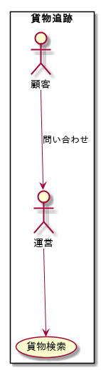

# エリックエヴァンス ドメイン駆動設計 第4回
## 第7章 言語を使用する : 応用例
**貨物輸送システム** を例に実際に作成されたドメインモデルから実装に落とし込む例みたいな


## 進め方
例題となっている **貨物輸送システム** システムを、自分たちで設計・実装してみよう！


## 設計・実装のためのインプット
7章の触りを読んで、設計・実装する上でのインプットとなるものを軽くまとめた

**ドメインモデルは自分たちで作るべきだと思うので、インプットとして使わない**

### 業務用券
* 顧客貨物に対する主要な荷役を追跡できる
* あらかじめ貨物を予約できる
* 貨物が荷役の過程で所定の場所に到達した際に、自動的に請求書を顧客に送付する

### ユースケース
#### 貨物予約

#### 荷役

#### 追跡



## 目標
* ドメインモデルを設計する
* サンプルアプリケーションを作成する


## その他
### サンプルアプリケーションについて
サンプルとはいえ一応動いたほうがやった感あると思うので、軽く仕様をまとめた

#### 実行方法
ターミナルから実行されるCLIアプリケーション

次の形式で実行する

```console
$ [CARGO_SYSTEM_ROOT]/cargo-system/cargosystem.py [SUB_COMMAND] [SUM_COMMAND_ORDER] [INPUT]
```

#### Input
* inputが構造化データの場合
  - JSON形式ファイルのパス
* 非構造化データの場合
  - 文字列

#### Output
* ユーザへのアウトプット
  - 標準出力
    + 構造化データを出力する場合は **JSON形式** で出力する
* データ永続方法
  - オブジェクトをJSON形式にシリアライズして保存
