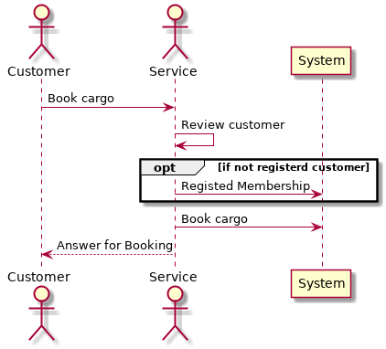
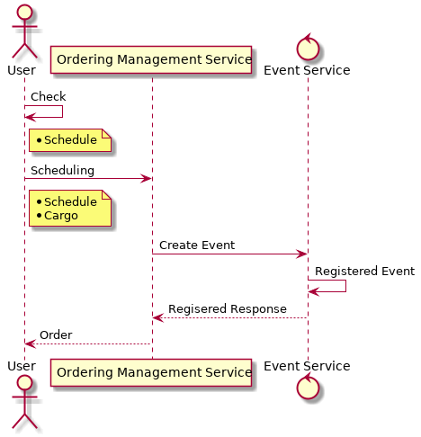

# 貨物輸送システムサンプルアプリケーション
## ビジネス要件
* 顧客貨物に対する主要な荷役を追跡できる
* あらかじめ貨物を予約できる
* 貨物が荷役の過程で所定の場所に到達した際に、自動的に請求書を顧客に送付する


## システムユースケース図
### 貨物予約

### 荷役

### 問い合わせ


## 登場人物


### 運営
* システムの利用者
* 港 -> 港への運送の受付を担当する
* 顧客から貨物の運搬予約と問い合わせを受け付ける

### 顧客
* 海上の運搬を運営に依頼する
  - ヤマト運輸とかそんな感じのやつが顧客に当たる感じ？
* 次の役割を持つ顧客が存在する
  - 差出先
  - 受取先
  - 支払先


## ドメインモデル


## 業務フロー
### 貨物予約



## 処理フロー
### 貨物予約



## プログラムレイヤ
```text
.
├── application
│   ├── graphql
│   ├── grpc
│   └── rest
├── domain
│   ├── cargo
│   ├── order
│   ├── port
│   └── transport
└── service
```

| レイヤ      | 説明                                                                                |
|-------------|-------------------------------------------------------------------------------------|
| application | アプリケーションへのIOを扱う                                                        |
| service     | アプリケーションのユースケースを定義するレイヤ<br>ドメインの処理を呼び出す          |
| domain      | ドメインモデルのコードを定義するレイヤ<br>Factory、Repositoryもこのレイヤで定義する |


## 補足事項
### 荷役
* 貨物の積み込みや荷下ろし、あるいは倉庫・ヤード等への入庫・出庫を総称した作業

### 請求書の発行
* 請求書は貨物単位で発行される

### 制限事項
* 発注者 1 -- N 受取者
* 貨物の積載制限などは考えない
* 責任の移動

```text
| Sender |                  | Receiver |
    + ----- | Transport | ----- +
```

* スケジュールのチェックなどは運用回避とする
* 料金計算は行わない
* 船舶の運行状況や積載状況の管理は行わない


## 用語集
### Customer
* 発注者
* 受取人

### User(Service Provider)
* サービスプロバイダ

### Cargo Transport System(CTS)
* システム化対象

#### Ordering Management Service(OMS)
* 受発注管理サービス


## 議事録
* [第一回](docs/minutes/01.md)
* [第二回](docs/minutes/02.md)
