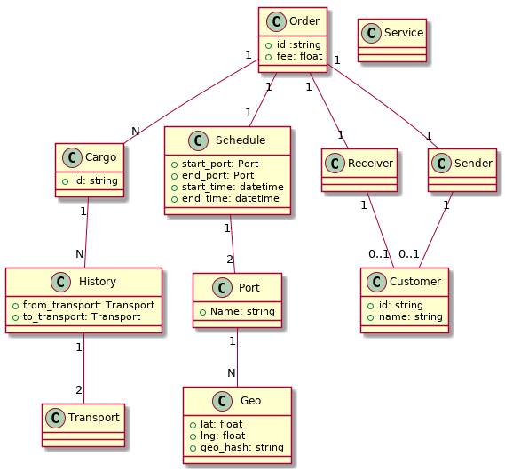
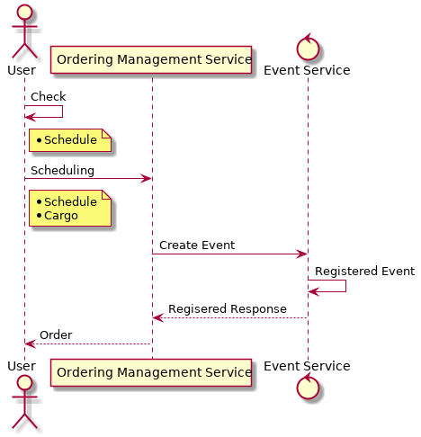
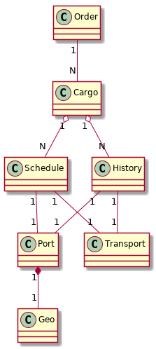

# 2018/12/29(土) 議事録
## やったこと
1. 業務フロー作成
2. ドメインモデル作成
3. 処理フロー作成
4. プロトタイプ作成
5. プロトタイプなどから、更にドメインモデルをブラッシュアップ

---

## 業務フロー作成
* 業務要件、ユースケース図を元に、貨物予約の業務フローを作成
* 登場人物の整理と、アクターなどの名称を決定

### 完成した業務フロー

## ドメインモデル作成
* 業務フローからドメインモデルを作成

### 完成したドメインモデル

## 処理フロー作成
* ドメインモデルより貨物予約の際のシステム処理フローを作成

## プロトタイプ
* 処理フロー、ドメインモデルからコードのプロトタイプを作成
  - [作成したプロトタイプ](https://github.com/dokurin/dokushokai/tree/0cce39452084d5e2dc6552cae9e05b3da4ba2606/season2-DDD/cargo-system)

## ドメインモデルリファクタリング
* 凝集について議論
* エンティティ、値オブジェクトについて議論
* プロトタイプなどから、更にドメインモデルをブラッシュアップ

### リファクタリング後のドメインモデル(WIP)

---

## 残タスク
* リファクタリングしたドメインモデルのfix
* 荷役の業務フロー 〜 を作成
* 貨物問い合わせの業務フロー 〜 を作成
* プログラムレイヤ設計
